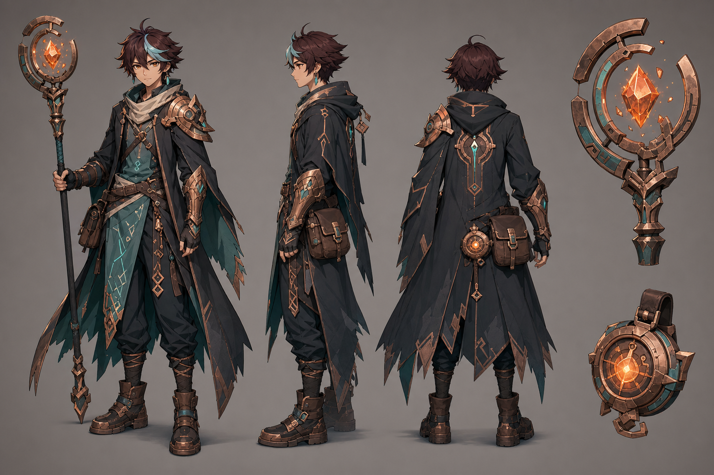
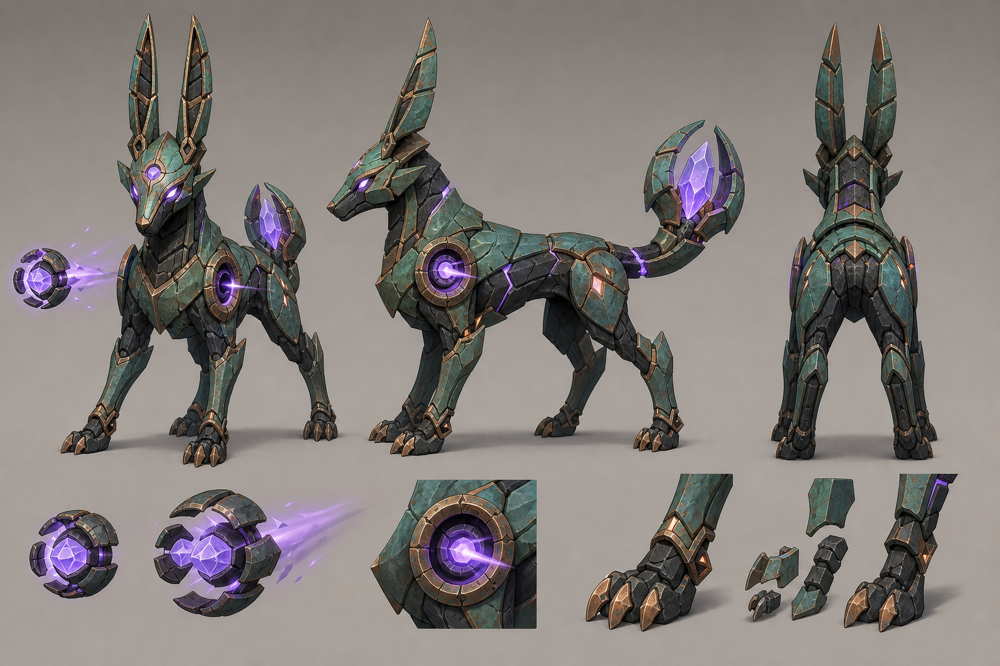

# 余烬深渊 · 第二阶段美术样板

## 视觉方向

项目采用原创的“动漫卡通渲染 × 铜锈魔导 × 球形废土幻想”风格。

技术上参考高品质动漫风格 3D 游戏常用的造型、分层光照和手绘材质方法，但不复刻任何现有作品的角色、服装、武器、怪物、图标、剧情或世界设定。

核心配色：

- 氧化铜绿 `#3f8f83`
- 暗炭黑 `#171d20`
- 旧铜金 `#a66a46`
- 余烬橙 `#ff7a38`
- 魔能紫 `#9b72ff`

## 美术样板

### 星炉旅者



原创主角定位为使用浮环法杖的魔导旅者。服装由暗色不对称披风、铜质护具、符文织物和旅行装备组成，不使用学院制服、神明服饰或现有游戏角色的标志性结构。

游戏内辨识要点：

- 中远距离仍能识别的长披风三角轮廓。
- 青绿色织物负责区分身体朝向。
- 橙色法杖核心承担施法和技能蓄力反馈。
- 铜质肩甲与前臂护具提供近景材质细节。

### 铜绿灯豺



原创远程小怪定位为高速魔导构装兽。肩部圆形结构发射紫色弹幕，尾部晶体显示剩余魔能和攻击前摇。

战斗辨识要点：

- 细长耳部和低伏四足结构代表高速移动。
- 肩部发射器朝向玩家时表示即将射击。
- 紫色晶体增亮、尾部张开构成远程攻击预警。
- 破甲或濒死状态通过铜绿装甲脱落表现。

## Blender 建模规格

### 坐标与导出

- 单位：米。
- 上方向：`+Y`。
- 角色正面：`-Z`。
- 角色原点位于两脚之间的地面中心。
- 导出格式：glTF 2.0 Binary（`.glb`）。
- 变换导出前应用，模型根节点缩放保持 `1, 1, 1`。
- 动画使用独立 Action，并在 GLB 中按名称导出。

### 星炉旅者

- 身高：约 `1.76m`。
- 主模型预算：`35,000–55,000` 三角面。
- LOD1：主模型的约 `55%`。
- LOD2：主模型的约 `25%`。
- 骨骼：`70–90` 根，包含披风、发束、法杖环和饰物辅助骨。
- 贴图：一套 `2048×2048` 主图集，面部可使用独立 `1024×1024` 图集。
- 材质槽建议：皮肤、头发、布料、铜甲、法杖晶体。

首批动画：

1. `Idle`
2. `Walk`
3. `Run`
4. `Sprint`
5. `Attack_Cast`
6. `Attack_Release`
7. `Nova_Cast`
8. `Dash`
9. `Ward_Cast`
10. `Hit`
11. `Knockdown`
12. `Death`

### 铜绿灯豺

- 肩高：约 `0.9m`。
- 主模型预算：`18,000–30,000` 三角面。
- LOD1：主模型的约 `50%`。
- LOD2：主模型的约 `22%`。
- 骨骼：`35–50` 根，包含耳部、装甲片、肩部发射器和分段尾部。
- 贴图：一套 `2048×2048` 图集。
- 材质槽建议：暗色矿物、铜绿装甲、旧铜边框、紫色晶体。

首批动画：

1. `Idle`
2. `Walk`
3. `Run`
4. `Strafe_Left`
5. `Strafe_Right`
6. `Attack_Aim`
7. `Attack_Volley`
8. `Hit`
9. `Armor_Break`
10. `Death`

## Three.js 卡通材质规格

- 基础色使用手绘渐变，避免写实照片纹理。
- 主光阴影压缩为亮面、过渡面和暗面三层。
- 皮肤和布料使用柔和冷阴影；铜材质使用暖色高光。
- 头发使用独立高光带，不使用写实各向异性反射。
- 晶体与符文使用 Emissive 贴图，并由技能状态驱动强度。
- 角色边缘采用基于视角的柔和 Rim Light，不使用过粗黑色描边。
- 远景 LOD 关闭小型发光部件和披风辅助骨计算。

## 原创性边界

- 不导入、描摹或重制现有商业游戏模型。
- 不复刻现有角色的发型、服装结构、武器轮廓或配色组合。
- 不使用现有作品的国家、阵营、元素图标和命名体系。
- 所有角色名称、怪物生态、技能图形和世界设定均属于“余烬深渊”原创体系。

## 下一步

样板确认后进入第一个可玩美术垂直切片：

1. 制作星炉旅者基础模型、骨骼和四个核心战斗动画。
2. 制作铜绿灯豺基础模型、骨骼和远程齐射动画。
3. 在 Three.js 中建立动漫分层材质和发光控制器。
4. 用 GLB 模型替换当前程序几何体，同时保留原模型作为低性能回退方案。
5. 完成一次电脑端性能与战斗可读性验收。

## 第一版垂直切片已交付

本目录现已包含可直接继续精修的 Blender 源文件、运行时 GLB 和预览图：

- `blender/starforge-traveler-v1.blend`：星炉旅者模型、骨骼与 9 组动作。
- `blender/verdigris-lantern-jackal-v1.blend`：铜绿灯豺模型、骨骼与 10 组动作。
- `previews/`：两套 Blender 灯光预览。
- `../../public/assets/models/`：供 Three.js 按需加载的 GLB。
- `../../tools/blender/build_phase2_assets.py`：可重复构建全部资产的 Blender 脚本。

Three.js 运行时已加入四阶卡通明暗材质、骨骼动画状态机和加载失败回退。星炉旅者会根据移动与技能状态切换动作；原“幽光生物”远程怪已替换为铜绿灯豺，并支持移动、侧移、齐射、受击与死亡动作。程序化旧模型仍保留在内存中，仅当 GLB 加载失败时显示。

在项目目录重新生成资产：

```powershell
& 'D:\Program Files\blender.exe' --background --python '.\tools\blender\build_phase2_assets.py'
```
